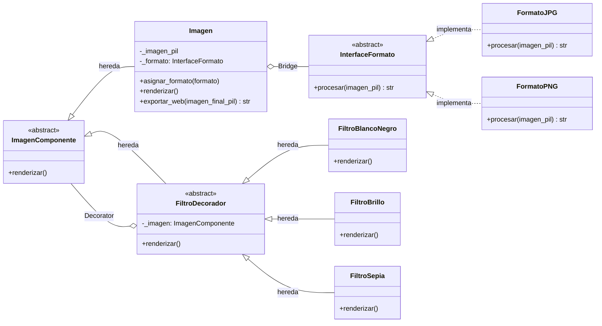

# Documentacion Detallada del Codigo

## 1. Objetivo de este documento
Este archivo explica el proyecto en modo lectura de codigo: que hace cada seccion, como fluye la informacion y como se conectan las clases entre si.

Archivos principales:
- Backend: [app.py](app.py)
- Vista HTML: [templates/index.html](templates/index.html)
- Configuracion Tailwind: [tailwind.config.js](tailwind.config.js)
- Entrada CSS de Tailwind: [static/src/input.css](static/src/input.css)
- Dependencias de frontend: [package.json](package.json)

## 2. Resumen rapido del comportamiento
La aplicacion permite:
1. Subir una imagen JPG o PNG.
2. Elegir filtros visuales.
3. Procesar la imagen en el servidor con Pillow.
4. Devolver la imagen final en formato base64 para mostrarla en la pagina.
5. Descargar el resultado desde el navegador.

## 3. Mapa general de arquitectura

### 3.1 Capa de presentacion
Vive en [templates/index.html](templates/index.html). Contiene:
- Formulario de carga de archivo.
- Checkboxes de filtros.
- Zona para mostrar errores.
- Zona para mostrar resultado y descarga.

### 3.2 Capa de aplicacion
Vive en [app.py](app.py), principalmente en la ruta principal /. Se encarga de:
- Recibir datos del formulario.
- Guardar/abrir imagen.
- Construir el flujo de filtros.
- Exportar resultado para web.

### 3.3 Capa de dominio de imagen
Tambien vive en [app.py](app.py) y usa clases para:
- Definir como exportar por formato (Bridge).
- Definir filtros encadenables (Decorator).

## Diagrama UML del proyecto (Bridge + Decorator)

### UML de clases



### Como leer estos diagramas
1. Bridge se ve en la relacion entre Imagen y InterfaceFormato: la abstraccion de imagen delega la exportacion al formato concreto.
2. Decorator se ve en la jerarquia de FiltroDecorador y sus filtros concretos: cada filtro envuelve un ImagenComponente.
3. En tiempo de ejecucion, la ruta arma una cadena de decoradores segun los checks del usuario.
4. El resultado final se exporta con el formato seleccionado y se devuelve como base64 a la vista.

## 4. app.py explicado por bloques

### 4.1 Imports
Fragmento de [app.py](app.py):

```python
from flask import Flask, render_template, request
from abc import ABC, abstractmethod
from PIL import Image as PILImage, ImageEnhance, ImageOps
from io import BytesIO
import base64
import os
```

Que aporta cada import:
1. Flask, render_template, request: servidor web, render de HTML y lectura de formularios.
2. ABC, abstractmethod: crear interfaces abstractas para los patrones.
3. PILImage, ImageEnhance, ImageOps: procesamiento de imagenes.
4. BytesIO: buffer en memoria para convertir imagen a bytes sin guardar archivo temporal.
5. base64: codificar bytes para incrustar imagen en HTML.
6. os: operaciones de rutas y creacion de carpeta.

### 4.2 Configuracion inicial de la app
Fragmento de [app.py](app.py):

```python
app = Flask(__name__)

CARPETAS_SUBIDAS = "static/uploads"
os.makedirs(CARPETAS_SUBIDAS, exist_ok=True)
app.config['MAX_CONTENT_LENGTH'] = 16 * 1024 * 1024
```

Explicacion:
1. Se crea la instancia Flask.
2. Se define la carpeta de uploads.
3. Se asegura que exista con makedirs.
4. Se fija limite de request en 16 MB.

## 5. Patron Bridge en detalle

### 5.1 Interfaz de formato
Fragmento de [app.py](app.py):

```python
class InterfaceFormato(ABC):
    @abstractmethod
    def procesar(self, imagen_pil) -> str:
        pass
```

Idea clave:
- Cualquier formato de salida debe implementar procesar y retornar string (data URL base64).

### 5.2 Implementacion FormatoJPG
Fragmento de [app.py](app.py):

```python
class FormatoJPG(InterfaceFormato):
    def procesar(self, imagen_pil) -> str:
        if imagen_pil.mode in ("RGBA", "P"):
            imagen_pil = imagen_pil.convert("RGB")

        buffered = BytesIO()
        imagen_pil.save(buffered, format="JPEG")
        img_str = base64.b64encode(buffered.getvalue()).decode("utf-8")
        return f"data:image/jpeg;base64,{img_str}"
```

Paso a paso:
1. Si la imagen viene con transparencia o paleta, se convierte a RGB.
2. Se guarda en memoria como JPEG.
3. Se codifica en base64.
4. Se arma data URL lista para usar en src de img.

### 5.3 Implementacion FormatoPNG
Fragmento de [app.py](app.py):

```python
class FormatoPNG(InterfaceFormato):
    def procesar(self, imagen_pil) -> str:
        buffered = BytesIO()
        imagen_pil.save(buffered, format="PNG")
        img_str = base64.b64encode(buffered.getvalue()).decode("utf-8")
        return f"data:image/png;base64,{img_str}"
```

Diferencia principal frente a JPG:
- PNG no requiere conversion a RGB en este flujo.

### 5.4 Clase Imagen como abstraccion puente
Fragmento de [app.py](app.py):

```python
class Imagen(ImagenComponente):
    def __init__(self, imagen_pil, formato: InterfaceFormato):
        self._imagen_pil = imagen_pil
        self._formato = formato

    def asignar_formato(self, formato: InterfaceFormato):
        self._formato = formato

    def renderizar(self):
        return self._imagen_pil.copy()

    def exportar_web(self, imagen_final_pil) -> str:
        return self._formato.procesar(imagen_final_pil)
```

Claves:
1. Imagen conoce el objeto PIL y el formato de salida.
2. Puede cambiar formato en runtime con asignar_formato.
3. renderizar devuelve copia para evitar mutaciones acumuladas.
4. exportar_web delega la conversion al formato configurado.

## 6. Patron Decorator en detalle

### 6.1 Componente base y decorador base
Fragmento de [app.py](app.py):

```python
class ImagenComponente(ABC):
    @abstractmethod
    def renderizar(self):
        pass


class FiltroDecorador(ImagenComponente):
    def __init__(self, imagen: ImagenComponente):
        self._imagen = imagen

    @abstractmethod
    def renderizar(self) -> str:
        pass
```

Concepto:
- Cualquier filtro recibe un componente de imagen y define su propia transformacion.

### 6.2 Filtros concretos
Fragmento de [app.py](app.py):

```python
class FiltroBlancoNegro(FiltroDecorador):
    def renderizar(self):
        img = self._imagen.renderizar()
        return ImageOps.grayscale(img)


class FiltroBrillo(FiltroDecorador):
    def renderizar(self):
        img = self._imagen.renderizar()
        enhancer = ImageEnhance.Brightness(img)
        return enhancer.enhance(1.5)


class FiltroSepia(FiltroDecorador):
    def renderizar(self):
        img = self._imagen.renderizar()
        gris = ImageOps.grayscale(img)
        return ImageOps.colorize(gris, black="#402000", white="#ffcc99")
```

Lectura simple:
1. Cada filtro toma la salida del componente interno.
2. Aplica su efecto.
3. Devuelve nueva imagen.

## 7. Flujo de la ruta principal

### 7.1 Firma de ruta
Fragmento de [app.py](app.py):

```python
@app.route('/', methods=['GET', 'POST'])
def index():
```

Soporta:
1. GET: carga inicial de pagina.
2. POST: procesamiento de archivo y filtros.

### 7.2 Variables de estado para plantilla
Fragmento de [app.py](app.py):

```python
imagen_b64 = None
error = None
nombre_archivo = None
```

Se envian al render final para que Jinja decida que mostrar.

### 7.3 Entrada del formulario
Fragmento de [app.py](app.py):

```python
archivo = request.files.get("archivo")
nombre_archivo_oculto = request.form.get("nombre_archivo_oculto")
```

Hay dos escenarios:
1. Archivo nuevo desde input file.
2. Reuso de archivo previamente cargado mediante hidden input.

### 7.4 Escenario A: archivo nuevo
Fragmento de [app.py](app.py):

```python
if archivo and archivo.filename:
    nombre_archivo = archivo.filename
    ruta_guardado = os.path.join(CARPETAS_SUBIDAS, nombre_archivo)
    archivo.save(ruta_guardado)
    imagen_pil = PILImage.open(ruta_guardado)
```

Que hace:
1. Obtiene nombre y ruta de destino.
2. Guarda archivo en disco.
3. Lo reabre con Pillow para procesar.

### 7.5 Escenario B: reusar archivo previo
Fragmento de [app.py](app.py):

```python
elif nombre_archivo_oculto:
    nombre_archivo = nombre_archivo_oculto
    ruta_guardado = os.path.join(CARPETAS_SUBIDAS, nombre_archivo)
    imagen_pil = PILImage.open(ruta_guardado)
```

Permite aplicar nuevos filtros sin volver a subir archivo.

### 7.6 Seleccion de formato por extension
Fragmento de [app.py](app.py):

```python
extension = nombre_archivo.lower().split('.')[-1]

if extension in ["jpg", "jpeg"]:
    formato = FormatoJPG()
elif extension == "png":
    formato = FormatoPNG()
else:
    return render_template('index.html', error="Formato no soportado.")
```

Resultado:
- Se crea la estrategia de formato para exportar.

### 7.7 Cadena de filtros dinamica
Fragmento de [app.py](app.py):

```python
imagen_base = Imagen(imagen_pil, formato)
imagen_procesada = imagen_base
filtros_seleccionados = request.form.getlist("filtros")

if "bn" in filtros_seleccionados:
    imagen_procesada = FiltroBlancoNegro(imagen_procesada)
if "brillo" in filtros_seleccionados:
    imagen_procesada = FiltroBrillo(imagen_procesada)
if "sepia" in filtros_seleccionados:
    imagen_procesada = FiltroSepia(imagen_procesada)

resultado_pil = imagen_procesada.renderizar()
imagen_b64 = imagen_base.exportar_web(resultado_pil)
```

Como leer este bloque:
1. Imagen base inicia la cadena.
2. Cada if envuelve la imagen actual con un nuevo decorador.
3. renderizar ejecuta toda la cadena.
4. exportar_web convierte salida final en base64.

### 7.8 Render final
Fragmento de [app.py](app.py):

```python
return render_template(
    'index.html',
    imagen_b64=imagen_b64,
    nombre_archivo=nombre_archivo,
    error=error
)
```

La plantilla recibe estado completo para pintar:
1. Error (si existe).
2. Nombre de archivo activo.
3. Imagen final procesada.

## 8. index.html explicado por secciones

### 8.1 Encabezado y CSS
En [templates/index.html](templates/index.html) se importa CSS compilado:

```html
<link rel="stylesheet" href="{{ url_for('static', filename='css/output.css') }}">
```

### 8.2 Bloque de error condicional

```html

  <div>...</div>

```

Si el backend envia texto en error, se muestra alerta en pantalla.

### 8.3 Formulario principal

```html
<form method="POST" enctype="multipart/form-data" class="space-y-8">
```

Detalles:
1. method POST para enviar datos.
2. enctype multipart/form-data para incluir archivo.

### 8.4 Estado de imagen activa

```html

  <input type="hidden" name="nombre_archivo_oculto" value="{{ nombre_archivo }}">

```

Permite mantener referencia del archivo entre envios.

### 8.5 Input de archivo

```html
<input id="archivo" name="archivo" type="file" class="sr-only" accept=".jpg, .jpeg, .png">
```

El atributo accept filtra la seleccion en UI.

### 8.6 Checkboxes de filtros

```html
<input type="checkbox" name="filtros" value="bn">
<input type="checkbox" name="filtros" value="brillo">
<input type="checkbox" name="filtros" value="sepia">
```

Todos comparten name filtros para que Flask los reciba como lista.

### 8.7 Resultado y descarga

```html

  
  <a href="{{ imagen_b64 }}" download="imagen_editada_{{ nombre_archivo }}">Descargar Imagen</a>

```

Mecanica:
1. src usa data URL base64.
2. href usa la misma data URL para descarga directa.

## 9. Ejemplo completo del flujo de datos
Ejemplo real de ejecucion:
1. Usuario sube foto.png y marca bn + brillo.
2. POST llega con archivo y filtros.
3. app.py guarda foto.png en static/uploads.
4. Pillow abre la imagen.
5. Se selecciona FormatoPNG.
6. Se crea Imagen(base).
7. Se aplica FiltroBlancoNegro.
8. Se aplica FiltroBrillo sobre el resultado anterior.
9. renderizar devuelve imagen final en memoria.
10. exportar_web devuelve data:image/png;base64,....
11. index.html muestra la imagen y habilita descarga.

## 10. Como extender el codigo sin romper el diseno

### 10.1 Agregar nuevo filtro
Ejemplo de filtro desenfoque:

```python
from PIL import ImageFilter

class FiltroDesenfoque(FiltroDecorador):
    def renderizar(self):
        img = self._imagen.renderizar()
        return img.filter(ImageFilter.GaussianBlur(radius=2))
```

Luego en la ruta:

```python
if "blur" in filtros_seleccionados:
    imagen_procesada = FiltroDesenfoque(imagen_procesada)
```

Y en HTML:

```html
<input type="checkbox" name="filtros" value="blur">
```

### 10.2 Agregar nuevo formato de salida
Ejemplo WEBP:

```python
class FormatoWEBP(InterfaceFormato):
    def procesar(self, imagen_pil) -> str:
        buffered = BytesIO()
        imagen_pil.save(buffered, format="WEBP")
        img_str = base64.b64encode(buffered.getvalue()).decode("utf-8")
        return f"data:image/webp;base64,{img_str}"
```

Y seleccionarlo por extension en la ruta.

## 11. Relacion entre archivos de estilos

### 11.1 tailwind.config.js
Define que archivos escanear para clases Tailwind:
- [templates/index.html](templates/index.html)
- [app.py](app.py)

### 11.2 static/src/input.css
Contiene directivas base de Tailwind:

```css
@tailwind base;
@tailwind components;
@tailwind utilities;
```

### 11.3 static/css/output.css
Es el CSS compilado final que carga la vista.

## 12. Resumen final de entendimiento
Este proyecto tiene una estructura clara para aprender patrones de diseno aplicados a un caso real.

Idea central:
1. Bridge decide como exportar la imagen.
2. Decorator decide como transformar la imagen.
3. Flask orquesta entrada, proceso y salida.
4. Jinja muestra resultados en una interfaz simple.

Con esta base puedes leer, mantener y extender el sistema sin perder orden conceptual.

## 13. Evidencia visual del uso del programa

Esta seccion resume que pasa cuando usas la interfaz (subir imagen, elegir filtros y procesar), usando imagenes que existen en el proyecto.

### 13.1 Imagen de entrada: escena con color alto


Que pasa aqui:
1. Esta imagen representa el estado base sin filtro.
2. Cuando el usuario pulsa Procesar Imagen sin checks, se conserva la imagen original (solo cambia el flujo de salida a base64).
3. El sistema respeta el formato elegido en funcion de la extension del archivo.

### 13.2 Imagen de entrada: arquitectura con alto contraste


Que pasa aqui:
1. Esta imagen sirve para observar bien el filtro de brillo.
2. Si se marca brillo, el programa usa ImageEnhance.Brightness(...).enhance(1.5).
3. El resultado aclara la escena y aumenta intensidad de zonas luminosas.

### 13.3 Imagen de entrada: fondo claro y objeto principal


Que pasa aqui:
1. Esta imagen permite ver claramente los cambios de tono.
2. Si se marca sepia, el flujo convierte primero a gris y luego coloriza con tonos marron.
3. Si se marca blanco y negro, la salida elimina color y conserva luminancia.

### 13.4 Descarga de imagen

Imagen de referencia del resultado listo para descarga:


Que pasa en este estado:
1. La imagen ya fue procesada por la cadena de filtros seleccionada.
2. Debajo del resultado aparece el boton con el texto Descargar Imagen.
3. Al hacer clic, el navegador descarga el archivo generado con nombre imagen_editada_{nombre_archivo}.

### 13.5 Explicacion de lo que se ve en tus capturas

En tus capturas del navegador se aprecia exactamente este ciclo de ejecucion:
1. El usuario tiene una imagen activa (se muestra en la tarjeta Editando actualmente).
2. Marca o desmarca filtros.
3. Al enviar, Flask reconstruye la cadena de decoradores en tiempo real.
4. Se recalcula la imagen final y se vuelve a pintar en Resultado Final.
5. El boton Descargar Imagen usa la misma salida base64 que se muestra en pantalla.

### 13.6 Mapa rapido de filtro -> efecto visual

1. Blanco y Negro: elimina crominancia, conserva estructura de luces y sombras.
2. Brillo (+50%): incrementa intensidad de luminosidad global.
3. Efecto Sepia: aplica escala de grises y luego recoloriza a una paleta calida.
4. Combinacion de filtros: cada efecto se aplica sobre el resultado del anterior (encadenamiento Decorator).
